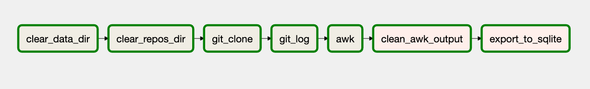
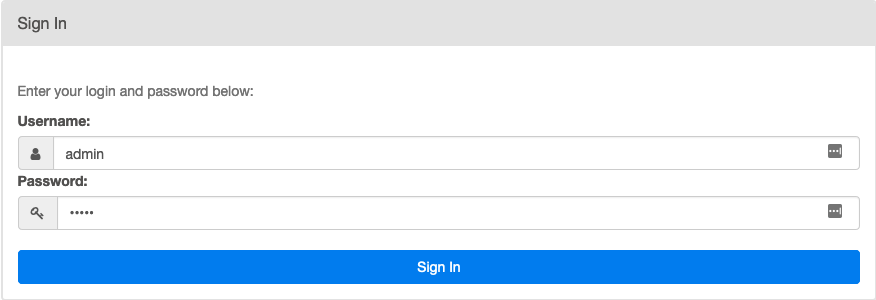
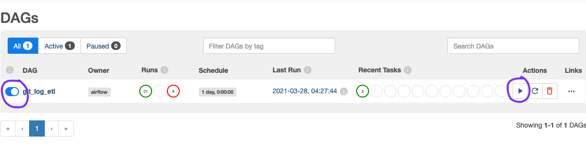

# *gitlog → sqlite* data pipeline

*gitlog → sqlite* is a data pipeline that pulls .git directories from repositories, then transforms git log outputs into queryable tables in an sqlite database. The *gitlog → sqlite* pipeline is run by a DAG ,`git_log_etl` (shown in image below),  that is executed on a dockerized, single-node Airflow installation based on this [template](https://github.com/soggycactus/airflow-repo-template). All data (json files, sqlite, csv, etc) are placed in the *data* directory of this repository after the DAG has finished running. 





## poke around the data:

You don't have to run the data pipeline to poke around the data; simply download the  `commit.db` sqlite file from the data directory of this repository, and query it with the sqlite client of your choice. For each repository specified in the Airflow Variables (more on how to set those variables in the next section), two tables are created in `commit.db` per repository. These are named with the following template: `{name of repo}_commits` and `{name of repo}_files_changed`. Currently the pipeline includes tables for  [Luigi](https://github.com/spotify/luigi) and [Scala](https://github.com/scala/scala), however other repositories can be added by changing the `repo_urls` Airflow Variable.  Let us take the tables created for the Luigi project:

- **luigi_commits**: a table that, for each commit, has the following columns
    - **commit**: the full commit hash
    - **abbreviated_commit**: first 8 digits of the commit hash
    - **name**: the name of the author of the commit
    - **email**: email of the author of the commit
    - **date**: the date of the commit as a UNIX timestamp

```
sqlite> select * from luigi_commits;

index       commit                                    abbreviated_commit  name          email                                 date      
----------  ----------------------------------------  ------------------  ------------  ------------------------------------  ----------
0           dba82cc2600d9780f8e9a0b111315e11abf9be84  dba82cc2            Justin Sousa  justinsousa@users.noreply.github.com  1616894023
1           a39c7f9249b02ac4bff8af8265df1ad6cc9ee946  a39c7f92            Honnix        honnix@users.noreply.github.com       1616497035
2           7508cdf8af8161adfbe2d911e71f7aab38152a48  7508cdf8            hirosassa     hiro.sassa@gmail.com                  1614100064
3           31d98156a5e044d643184fd153677e828b2a6e3e  31d98156            Honnix        honnix@users.noreply.github.com       1613569795
4           005d2883037961a5875ba6515df7182599a354e1  005d2883            Vincent Barb  vbarbaresi@users.noreply.github.com   1612987425
5           92096a9ed080768574d86f5c3829b7ec31ac314d  92096a9e            hirosassa     hiro.sassa@gmail.com                  1612986718
6           f0a63284a2866a5f8b461bc0a664b812c6bc4c42  f0a63284            Honnix        honnix@users.noreply.github.com       1612260928
7           7b7ff901480d9a02402037e0cb54e4508b5a94a2  7b7ff901            Simone Aiell  aiello.simone103@gmail.com            1610627624
8           3d9fa41621ebe4b834fd23eb5fb820a6dd1676cb  3d9fa416            jarno-r       jrajala35@gmail.com                   1610579536
9           de411653c911ad77b871f7e7dad51a537dce0b0d  de411653            hirosassa     hiro.sassa@gmail.com                  1610546751
```


- **luigi_files_changed**: 
    - **lines_added**: the number of lines added to the file in file_path
    - **lines_deleted**: number of lines deleted in file at file_path
    - **file_path**: the file that has been changed
    - **name_change**: boolean integer that indicates whether the file change was a name change
    - **is_binary_file**: boolean integer that indicates whether file_path file is binary
    - **commit**: the full commit hash
    - **abbreviated_commit**: first 8 digits of the commit hash

```
sqlite> select * from luigi_files_changed limit 10;

index       lines_added  lines_deleted  file_path                  name_change  is_binary_file  commit                                    abbreviated_commit
----------  -----------  -------------  -------------------------  -----------  --------------  ----------------------------------------  ------------------
0           2.0          2.0            doc/central_scheduler.rst  0            0               dba82cc2600d9780f8e9a0b111315e11abf9be84  dba82cc2          
1           1.0          1.0            .github/CODEOWNERS         0            0               a39c7f9249b02ac4bff8af8265df1ad6cc9ee946  a39c7f92          
2           18.0         24.0           luigi/rpc.py               0            0               7508cdf8af8161adfbe2d911e71f7aab38152a48  7508cdf8          
3           4.0          10.0           test/rpc_test.py           0            0               7508cdf8af8161adfbe2d911e71f7aab38152a48  7508cdf8          
4           3.0          9.0            test/worker_test.py        0            0               7508cdf8af8161adfbe2d911e71f7aab38152a48  7508cdf8          
5           2.0          2.0            README.rst                 0            0               31d98156a5e044d643184fd153677e828b2a6e3e  31d98156          
6           11.0         11.0           test/contrib/azureblob_te  0            0               005d2883037961a5875ba6515df7182599a354e1  005d2883          
7           0.0          3.0            README.rst                 0            0               92096a9ed080768574d86f5c3829b7ec31ac314d  92096a9e          
8           4.0          1.0            scripts/ci/install_start_  0            0               f0a63284a2866a5f8b461bc0a664b812c6bc4c42  f0a63284          
9           1.0          1.0            tox.ini                    0            0               f0a63284a2866a5f8b461bc0a664b812c6bc4c42  f0a63284  
```


## install and run

To run this data pipeline,  first ensure that you have docker installed and running. After you've cloned this repository, run the following command in the root directory:

```
make start-airflow
```

Open a new browser tab, and navigate to [localhost:8080](http://localhost:8080/) where you will be met with sign in box. Type "admin" for both username and password and click "sign in".



Once you get to the DAGs page, to run the `git_log_etl` DAG, make sure the toggle is 'unpaused' as shown, and then click on the 'Trigger Dag' play button under 'Actions.'



Once your DAG run is finished (it may take some time) you should see a new sqlite file `commits.db` in the data directory. You can then stop Airflow with the command

```
make stop-airflow
```

For more information on the make directives, refer to the [Airflow Repo Template](https://github.com/soggycactus/airflow-repo-template) readme.


## reason for the project

*gitlog → sqlite* was developed to create a data source for vizualization dashboards of development progress in large open source projects. For example, one might want to create a contributor leaderboard, or a heat map (each file a colored node in a directory hierarchy) that shows which files have the most development activity. It might also be helpful to see contributions over the entire duration of the project as a stacked line chart. It might also be nice to check who the biggest contributor is for a given file (perhaps by aggregating `git log --oneline -M --stat --follow — file.name` output) . There are a myriad of uses for commit logs represented as tabular data.

The initial strategy for acquiring this data was to simply query the GitHub API. However, the API had serious performance limitations. To find all files associated with a given commit using the API, you first have to retrieve a list of commits from the repository endpoint (eg. `https://api.github.com/repos/scala/scala/commits`) and then for each commit, you had to use the SHA to query yet another enpoint for all the committed files (`https://api.github.com/repos/scala/scala/commits/{commit_sha}`). This meant, for each repository, one request had to be made for each commit in that repository's commit log. As of this writing, the 2.13.x branch of the scala repo has 36,665 commits. Performing a full load of the commit data from just that one repository would exhaust my  5,000 request-per-hour limit almost immediately. 

With the performance limitations of the Github REST API (the GraphQL API was no better here) I resorted to programatically downloading each repository and processing each one's `git log` output.
