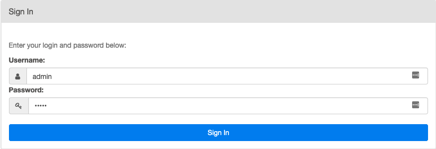
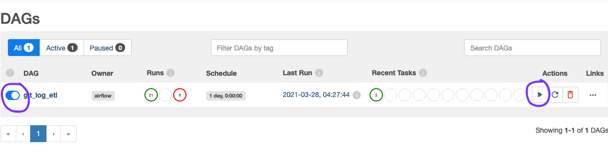

# gitlog → sqlite data pipeline

gitlog → sqlite is a data pipeline that clones github repositories, then transforms their git log outputs into sqlite. The gitlog → sqlite pipeline is run by a DAG ,`git_log_etl`,  that is executed on a dockerized, single-node Airflow installation based on this [template](https://github.com/soggycactus/airflow-repo-template). All data (json files, sqlite, csv, etc) are placed in the *data* directory of this repository after the DAG has finished running. 


## reason for the project

gitlog → sqlite was developed to create a data source for vizualization dashboards of development progress in large open source projects. For example, one might want to create a contributor leaderboard, or a heat map (each file a colored node in a directory hierarchy) that shows which files have the most development activity. It might also be helpful to see contributions over the entire duration of the project as a stacked line chart. It might also be nice to check who the biggest contributor is for a given file (perhaps by aggregating `git log --oneline -M --stat --follow — file.name` output) . There are a myriad of uses for commit logs represented as tabular data.

The initial strategy for acquiring this data was to simply query the GitHub API. However, the API had serious performance limitations. To find all files associated with a given commit using the API, you first have to retrieve a list of commits from the repository endpoint (eg. `https://api.github.com/repos/scala/scala/commits`) and then for each commit, you had to use the SHA to query yet another enpoint for all the committed files (`https://api.github.com/repos/scala/scala/commits/{commit_sha}`). This meant, for each repository, one request had to be made for each commit in that repository's commit log. As of this writing, the 2.13.x branch of the scala repo has 36,665 commits. Performing a full load of the commit data from just that one repository would exhaust my  5,000 request-per-hour limit almost immediately. 

With the performance limitations of the Github REST API (the GraphQL API was no better here) I resorted to programatically downloading each repository and processing each one's `git log` output.


The response of this second query is limited to 300 files, so 


## poke around the data:

You don't have to install this project to poke around the data; simply download the  `commit.db` sqlite file from the data directory of this repository, and query it with the sqlite client of your choice. 


## install and run

To run this data pipeline,  first ensure that you have docker installed and running. After you've cloned this repository, run the following command in the root directory

```
make start-airflow
```

Open a new browser tab, and navigate to [localhost:8080](http://localhost:8080/) where you will be met with sign in box. Type "admin" for both username and password and click "sign in".



Once you get to the DAGs page, to run the `git_log_etl` DAG, make sure the toggle is 'unpaused' as shown, and then click on the 'Trigger Dag' play button under 'Actions.'



Once your DAG run is finished (it may take some time) you should see a new sqlite file `commits.db` in the data directory. You can then stop Airflow with the command

```
make stop-airflow
```

For more information on the make directives, refer to the [Airflow Repo Template](https://github.com/soggycactus/airflow-repo-template) readme.


